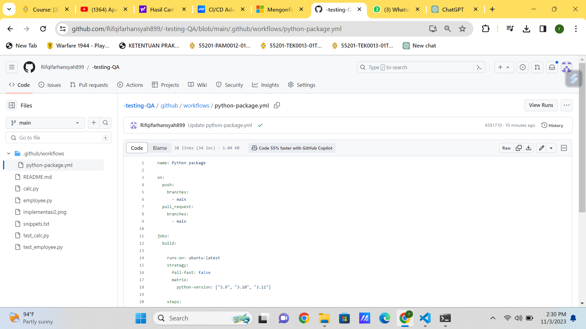

## Unit Testing
Referensi : https://youtu.be/9ydsDmjB1us?si=hy8WnaRpUC1iIVt_
UTS_rifqi farhansyah anshar_201011401636

## CI/CD beserta contoh langkah-langkah konfigurasinya untuk project python.
- buka GitHub
- Buat Akun
- Buat repositori baru
- pilih menu Action
- pilih python application
- pilih configure

- kita bisa edit sesuai keinginan
- setelah selesai pilih commit changes
 
- akan tampil jika berhasil ada tanda ceklis

